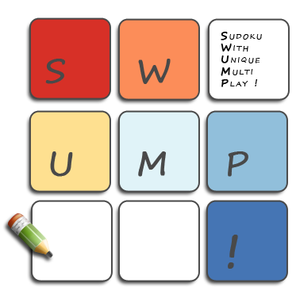

<h1 align="center">
  

  <p align="center">Swump! - Sudoku with Unique Multi Play</p>
</h1>

## Table of Contents test

- [Features](#features)
- [Development](#development)
    - [Requirements](#requirements)
    - [Build](#build)
- [Authors](#authors)

## Features

- Single-player mode with multiple difficulty levels and accessibility features (pencil marks, hints)
- Multi-player mode for up to 4 players with unique Power-ups
- Solver mode with custom regions and cell constraints

## Development

### Requirements

- JDK 17+

### Build

```shell
./gradlew clean build
```

## Authors

- Aik-Wei "Chris" Sng
- Binh-Nguyen "Ben" Tran
- Kang-Wei Wong
- Wei-Lun Lau
